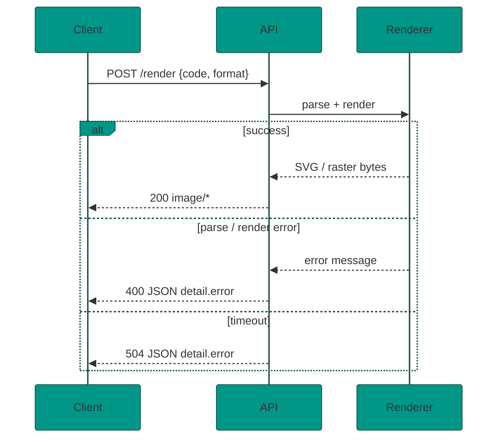

<div align="center">

# Mermaid Render API Specification

**Implementation contract** for the HTTP render service.

<br/>


<br/>

[README](README.md) · [Curl cookbook](docs/curl-examples.md) · [Brand / theme](docs/BRAND.md)

</div>

---

## Contents

| Section | Topic |
|---------|--------|
| [Goal](#goal) | What we are building |
| [Deployment](#deployment-target) | Cloud Run, access models, Apps Script alternative |
| [Stack](#recommended-stack) | Python, FastAPI, Playwright |
| [Mermaid engine](#mermaid-engine-source) | Pinning and install |
| [MVP scope](#mvp-scope) | Endpoints |
| [API contract](#api-contract) | Request/response shapes |
| [Rendering](#rendering-behavior) | Pipeline rules |
| [Security](#security-requirements) | Limits and hardening |
| [Layout](#suggested-project-layout) | Repository tree |
| [Acceptance](#acceptance-criteria) | Definition of done |

---

## Goal

Build a small HTTP API that receives Mermaid syntax text, renders it with the vendored Mermaid engine, and returns an image.

The repository can contain a local Mermaid runtime under `vendor/mermaid/` for development, but the preferred setup is to install a pinned Mermaid version during setup/build.

> **Note** — User-facing guides live in [README.md](README.md). This file is the engineering spec.

## Deployment Target

Primary target: Docker container deployable to Google Cloud Run.

Cloud Shell can be used to build, test, and deploy the container, but it should not be the long-running company-wide host. Cloud Shell web preview is intended for previewing apps from a Cloud Shell VM and access is proxied to the current user account. Cloud Shell sessions also terminate, so a service running only inside Cloud Shell is not suitable as a shared workplace API.

For company-wide access, deploy the container to Cloud Run and choose one of these access models:

- Internal company use with Google authentication: require IAM invocation and grant the right Google Workspace group access.
- Public URL protected by an API key or reverse proxy: useful only if IAM-based calls are inconvenient for clients.
- Internal-only ingress/VPC: use if the company already has the needed Google Cloud networking.

Cloud Run is preferred because it runs containers, gives a stable HTTPS endpoint, scales automatically, and does not require managing a VM.

## Alternative Deployment: Google Apps Script Web App

A Google Apps Script web app is a viable alternative if the first deliverable can be a browser-based internal tool instead of a full binary image API.

This matches URLs like:

```text
https://script.google.com/a/macros/<workspace-domain>/s/<deployment-id>/exec
```

Apps Script web apps can be deployed for users inside a Google Workspace domain. They support:

- `doGet(e)` for browser page requests.
- `doPost(e)` for HTTP POST requests.
- `HtmlService` for returning an interactive browser UI.
- `ContentService` for returning text-based responses such as JSON or plain text.

### Good Fit

Use Apps Script if the goal is:

- An internal company page available to everyone in the domain.
- A Mermaid editor/preview page.
- Client-side rendering in the user's browser.
- Download buttons for SVG/PNG/JPEG generated in the browser.
- Minimal infrastructure and no Cloud Run permissions.

### Poor Fit

Apps Script is not ideal if the goal is:

- A true API that returns `image/png` or `image/jpeg` bytes directly.
- Server-side rendering with Playwright/Chromium.
- Python implementation.
- Docker-based reproducible deployments.
- High-volume or automation-heavy use.

Reasoning: Apps Script `ContentService` is for text output, not arbitrary binary image responses. A browser app can still render Mermaid client-side and let the user download images, but that is different from an API endpoint returning image bytes.

### Apps Script MVP

Build a web app with:

- Textarea or code editor for Mermaid syntax.
- Format selector: SVG, PNG, JPEG.
- Background selector: transparent or white.
- Theme selector.
- Preview pane.
- Download button.
- Optional copy SVG button.

Rendering flow:

1. `doGet()` returns an HTML page.
2. The HTML page loads Mermaid from a pinned CDN URL or bundled Apps Script HTML file.
3. The browser calls `mermaid.initialize({ startOnLoad: false, securityLevel: "strict" })`.
4. The browser calls `mermaid.parse(code)` and `mermaid.render(id, code)`.
5. SVG download returns the rendered SVG string as a Blob.
6. PNG/JPEG download draws the SVG to a browser canvas and exports with `canvas.toBlob()`.

Recommended CDN format:

```html
<script type="module">
  import mermaid from "https://cdn.jsdelivr.net/npm/mermaid@11.15.0/dist/mermaid.esm.min.mjs";
</script>
```

Keep the version pinned. Avoid using `@latest` for the shared company tool.

### Apps Script API-Like Endpoint

If needed, `doPost(e)` can provide JSON, for example:

```json
{
  "svg": "<svg ...></svg>",
  "diagramType": "flowchart-v2"
}
```

But do not treat this as the primary PNG/JPEG API. For PNG/JPEG bytes, prefer Cloud Run.

## Recommended Stack

- Runtime: Python 3.12+
- HTTP server: FastAPI
- ASGI server: Uvicorn
- Rendering engine: Mermaid loaded in a Playwright Chromium page
- Browser runtime: Playwright Chromium
- Validation: Pydantic
- Tests: Pytest plus HTTPX

Reasoning: the HTTP API can be Python without losing the existing Mermaid engine. Mermaid itself is JavaScript and browser-oriented, so Python should call it through Playwright rather than trying to reimplement rendering. Playwright gives reliable SVG rendering and raster exports.

Tradeoff: the container still needs Node/browser assets indirectly because Mermaid runs inside Chromium. The API code can remain Python, but rendering is not pure Python.

## Mermaid Engine Source

Preferred repository setup: do not commit the full Mermaid distribution by default.

Instead, keep a small script that downloads or installs Mermaid at build time:

- Option A: use npm during the Docker build and install a pinned version, for example `mermaid@11.15.0`.
- Option B: keep `MERMAID_VERSION` as a build argument, defaulting to a pinned version.
- Option C: allow `MERMAID_VERSION=latest` only for manual experiments, not production builds.

Production builds should pin the Mermaid version. Using `latest` makes deployments non-reproducible and can silently change diagram output or parsing behavior.

The current vendored `vendor/mermaid/` directory can be used as a local reference while implementing the first version, but the final repository should be able to rebuild without committing the heavy Mermaid bundle.

## MVP Scope

| Endpoint | Purpose |
|----------|---------|
| `GET /health` | Liveness + engine version |
| `POST /validate` | Syntax check (JSON only) |
| `POST /render` | Image output |

No authentication is required for the first version.

## API Contract



### `GET /health`


Returns:

```json
{
  "status": "ok",
  "engine": "mermaid",
  "engineVersion": "11.15.0"
}
```

### `POST /validate`


Request:

```json
{
  "code": "flowchart TD\n  A[Start] --> B[End]"
}
```

Response :

```json
{
  "valid": true,
  "diagramType": "flowchart-v2"
}
```

Response :

```json
{
  "valid": false,
  "error": {
    "code": "MERMAID_PARSE_ERROR",
    "message": "Human readable parse error"
  }
}
```

### `POST /render`


Request:

```json
{
  "code": "flowchart TD\n  A[Start] --> B[End]",
  "format": "png",
  "background": "white",
  "theme": "default",
  "width": 1200,
  "height": 800,
  "scale": 1,
  "transparent": false
}
```

Fields:

- `code`: required Mermaid diagram text.
- `format`: optional, one of `svg`, `png`, `jpg`, `jpeg`. Default `png`.
- `background`: optional CSS color string. Default `white` for `jpg/jpeg`, `transparent` for `png/svg` when `transparent` is true, otherwise `white`.
- `theme`: optional Mermaid theme. Accept `default`, `neutral`, `dark`, `forest`, `base`. Default `default`.
- `width`: optional viewport width. Default `1200`. Min `100`, max `4000`.
- `height`: optional viewport height. Default `800`. Min `100`, max `4000`.
- `scale`: optional output device scale factor. Default `1`. Min `0.5`, max `3`.
- `transparent`: optional boolean. Default `false`. Only applies to `svg` and `png`.

Response:

| Format | Status | `Content-Type` |
|--------|--------|----------------|
| `svg` |  | `image/svg+xml` |
| `png` |  | `image/png` |
| `jpg` / `jpeg` |  | `image/jpeg` |

Headers:

- `Content-Type`
- `Content-Length`
- `Cache-Control: no-store`

Error responses are JSON:

```json
{
  "error": {
    "code": "MERMAID_PARSE_ERROR",
    "message": "Human readable error"
  }
}
```

## Rendering Behavior

1. Validate request body.
2. Reject oversized inputs before rendering.
3. Use Mermaid parse for syntax validation.
4. Render SVG with Mermaid.
5. If requested format is `svg`, return the SVG text directly.
6. If requested format is raster, mount the SVG into a Playwright page and screenshot the SVG bounding box.
7. For `jpg/jpeg`, always use an opaque background because JPEG does not support transparency.
8. For `png` with `transparent=true`, preserve transparency.
9. Reject Mermaid "error diagram" SVG output (`.error-icon` / `.error-text`) with `400` JSON instead of returning it as a successful image.

## Render Page Design

Use a single reusable Chromium browser instance and create isolated pages or browser contexts per request.

The page should:

- Inject Mermaid from `vendor/mermaid/dist/mermaid.min.js` via Playwright `add_script_tag` (more reliable in Docker than ESM `file://` imports).
- Call `mermaid.initialize({ startOnLoad: false, securityLevel: "strict", theme })`.
- Call `mermaid.parse(code)` before rendering.
- Call `mermaid.render(id, code)`.
- Insert the returned SVG into a controlled container.
- Compute the SVG bounding box before screenshotting.

Avoid exposing the API server filesystem beyond the Mermaid bundle needed by the render page.

## Security Requirements

> **Warning** — These are mandatory for MVP, not optional hardening.

- Default Mermaid `securityLevel` must be `strict`.
- Do not allow client-provided arbitrary Mermaid config in MVP.
- Do not allow remote asset loading from diagrams.
- Limit `code` length to 100 KB.
- Limit render timeout to 10 seconds per request.
- Limit viewport dimensions and scale as specified above.
- Return parse/render errors without stack traces.
- Ensure concurrent requests cannot share mutable Mermaid state unsafely. If Mermaid global state causes issues, create a fresh page per render.

## Suggested Project Layout

```text
.
├── Dockerfile
├── pyproject.toml
├── README.md
├── scripts
│   └── install_mermaid.sh
├── src
│   ├── main.py
│   ├── routes
│   │   ├── health.py
│   │   ├── render.py
│   │   └── validate.py
│   ├── render
│   │   ├── browser.py
│   │   ├── mermaid_renderer.py
│   │   └── render_page.html
│   └── validation
│       └── schemas.py
├── tests
│   ├── test_health.py
│   ├── test_validate.py
│   └── test_render.py
└── vendor
    └── mermaid
```

## Implementation Tasks For Cursor

1. Scaffold Python/FastAPI project files.
2. Add dependencies: `fastapi`, `uvicorn`, `pydantic`, `playwright`; dev dependencies `pytest`, `httpx`, `ruff`.
3. Add a Mermaid install/download script that can pin `MERMAID_VERSION`.
4. Add a Dockerfile that installs Python dependencies, Playwright Chromium, and Mermaid.
5. Implement request schemas and shared response error helpers.
6. Implement a Mermaid renderer service backed by Playwright.
7. Implement `/health`, `/validate`, and `/render`.
8. Add graceful shutdown that closes the Playwright browser.
9. Add tests for success and error cases.
10. Add README with local run, Docker run, Cloud Run deploy, and curl examples.

## Acceptance Criteria

| Criterion | Status |
|-----------|--------|
| `npm run dev` starts the API locally |  |
| `GET /health` returns  |  |
| `POST /validate` valid diagram metadata |  |
| `POST /validate`  for invalid syntax |  |
| `POST /render` non-empty SVG / PNG / JPEG |  |
| `transparent=true` for PNG and SVG |  |
| JPEG always opaque background |  |
| Invalid options → JSON errors |  |
| Render timeouts →  |  |
| Error diagrams → JSON, not image bytes |  |

## Curl Examples

See **[docs/curl-examples.md](docs/curl-examples.md)** for the full gallery, error-handling guide, and diagram-type coverage.

Quick samples (use `curl -fS` in automation):

```sh
curl -s http://localhost:3000/validate \
  -H 'content-type: application/json' \
  -d '{"code":"flowchart TD\nA-->B"}'

curl -fS http://localhost:3000/render \
  -H 'content-type: application/json' \
  -d '{"code":"flowchart TD\nA-->B","format":"png","background":"white"}' \
  --output diagram.png
```

## Open Questions

- Should the API eventually support authentication or API keys?
- Should rendered images be cacheable by hash of request body?
- Should user-provided Mermaid config be allowed in a later version?
- Should the service provide a Docker image as part of the first deliverable?

---

<div align="center">

<sub>Spec version tracks Mermaid <code>11.15.0</code> · themed docs: <a href="docs/BRAND.md">docs/BRAND.md</a></sub>

</div>
