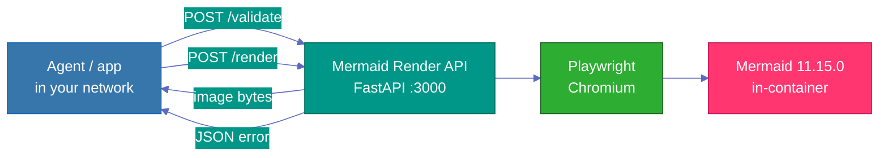

<div align="center">

# Mermaid Render API

**Private, in-house diagram rendering for your company — SVG, PNG, or JPEG over HTTP.**

A small [FastAPI](https://fastapi.tiangolo.com/) service that turns Mermaid source into images using a pinned [Mermaid](https://mermaid.js.org/) runtime in [Playwright](https://playwright.dev/) Chromium. Deploy on your network (Docker / [Cloud Run](https://cloud.google.com/run)) so diagram content never has to leave your environment.

<br/>


<br/>

[Quick start](#quick-start) · [API](#api) · [Examples](#examples) · [Docker](#docker) · [Curl cookbook](docs/curl-examples.md) · [Full spec](CURSOR_SPEC.md)

</div>

---

## Why this exists

Many teams want diagrams from **AI agents**, internal tools, or automation — but sending Mermaid source to public renderers, CDNs, or browser-based “paste your code” sites means **architecture, process, and customer data can leave the company**.

This API is an **internal diagram factory**:

- Agents (or humans) send **Mermaid text** to your instance.
- The service returns an **image** or a **JSON error** — nothing is forwarded to third-party diagram hosts.
- Rendering runs entirely on **your** infrastructure: pinned Mermaid, strict security level, no client-controlled config in MVP.

Typical callers:

- **LLM / agent workflows** — model outputs `flowchart TD…`, your orchestrator calls `POST /render`, stores PNG in docs or chat
- **Internal docs pipelines** — Markdown or tickets → diagram assets
- **Shared company endpoint** — one stable URL on Cloud Run or VPC, IAM-protected

> **Privacy by deployment** — Keep the service on a private network or Cloud Run with IAM. Diagram `code` stays between the client and your Chromium process; it is not sent to mermaid.live or similar public tools.



---

## Features

**Output formats:** `svg` · `png` · `jpg` / `jpeg`

| Capability | Details |
|------------|---------|
| **In-house rendering** | Self-hosted; diagram source stays on your network |
| **Agent-friendly** | Simple HTTP JSON in → image or structured error out |
| **Themes** | `default`, `neutral`, `dark`, `forest`, `base` |
| **Sizing** | Viewport 100–4000 px; scale 0.5–3× |
| **Transparency** | PNG & SVG (`transparent=true`) |
| **Safety** | `securityLevel: strict`; 100 KB code cap; 10 s timeout |
| **Errors** | JSON error codes — not error text baked into images |
| **Diagram types** | Flowchart, sequence, ER, **ishikawa-beta**, Gantt, mindmap, git graph, … |

---

## Quick start

**Prerequisites:** Python 3.12+, Node.js/npm (Mermaid install script), Chromium (via Playwright).

```sh
# 1. Dependencies
pip install -e ".[dev]"
playwright install --with-deps chromium

# 2. Pinned Mermaid runtime (not committed to git)
./scripts/install_mermaid.sh

# 3. Run
npm run dev
# → http://localhost:3000
```

**Smoke test**

```sh
curl -s http://localhost:3000/health | jq .

curl -fS http://localhost:3000/render \
  -H "content-type: application/json" \
  -d '{"code":"flowchart TD\n  A[Hello] --> B[World]","format":"png"}' \
  --output hello.png && file hello.png
```

---

## API

| Method | Path | Success (`200`) | Failure |
|:------:|:-----|-----------------|---------|
| `GET` | `/health` | JSON — status + engine version | — |
| `POST` | `/validate` | JSON — `valid`, `diagramType` | `400` parse error |
| `POST` | `/render` | Binary image (`image/png`, …) | `400` · `422` · `504` |

<details>
<summary><strong>POST /render</strong> — request body</summary>

| Field | Type | Default | Notes |
|-------|------|---------|-------|
| `code` | string | *required* | Mermaid source (max 100 KB) |
| `format` | string | `png` | `svg` · `png` · `jpg` · `jpeg` |
| `theme` | string | `default` | See themes above |
| `width` | int | `1200` | 100–4000 |
| `height` | int | `800` | 100–4000 |
| `scale` | float | `1` | 0.5–3 |
| `transparent` | bool | `false` | PNG & SVG only |
| `background` | string | auto | CSS color; JPEG always opaque |

</details>

<details>
<summary><strong>Error JSON shape</strong></summary>

```json
{
  "detail": {
    "error": {
      "code": "MERMAID_PARSE_ERROR",
      "message": "Human-readable explanation"
    }
  }
}
```

| Code | HTTP |
|------|------|
| `MERMAID_PARSE_ERROR` | `400` |
| `MERMAID_RENDER_TIMEOUT` | `504` |
| `MERMAID_RENDER_ERROR` | `500` |

</details>

Interactive docs when the server is running: [http://localhost:3000/docs](http://localhost:3000/docs)

---

## Examples

### Validate syntax (JSON in, JSON out)

```sh
curl -s http://localhost:3000/validate \
  -H "content-type: application/json" \
  -d '{"code":"flowchart TD\nA-->B"}' | jq .
```

### Render PNG

```sh
curl -fS http://localhost:3000/render \
  -H "content-type: application/json" \
  -d '{"code":"flowchart TD\nA-->B","format":"png","background":"white"}' \
  --output diagram.png
```

### Render transparent SVG

```sh
curl -fS http://localhost:3000/render \
  -H "content-type: application/json" \
  -d '{"code":"flowchart TD\nA-->B","format":"svg","transparent":true}' \
  --output diagram.svg
```

### Ishikawa (fishbone) diagram

Requires Mermaid 11.15.0+. See [docs/curl-examples.md §4](docs/curl-examples.md#4-ishikawa--fishbone-as-png).

---

## Error handling with curl

`POST /render` returns **either** an image **or** JSON — never both.

| Outcome | HTTP | Body |
|---------|------|------|
| OK | `200` | Binary image (`image/png`, …) |
| Bad syntax | `400` | JSON `MERMAID_PARSE_ERROR` |
| Bad options | `422` | JSON validation error |
| Timeout | `504` | JSON `MERMAID_RENDER_TIMEOUT` |

> **Tip** — Use `curl -fS` in scripts. Plain `curl -s` hides `HTTP 200` on success (body is binary).

**Gotchas**

- `curl --output file.png` writes the body even on `400` — you can end up with a JSON file named `.png`. Use **`curl -fS`** or check **`%{http_code}`**.
- `curl -s` alone does not print `HTTP 200`; success returns binary data that looks “silent” in the terminal.

```sh
# Recommended for scripts
curl -fS ... --output diagram.png

# Or show status explicitly
curl -sS -o diagram.png -w "HTTP %{http_code}\n" ...
```

Full guide: **[Error handling with curl](docs/curl-examples.md#error-handling-with-curl)** (status codes, `jq`, validate-then-render, typo traps).

---

## Development

```sh
npm test              # 19 tests (unit + route + e2e when Chromium is installed)
npm run test:e2e      # browser-backed only
ruff check .
```

| Layer | What it covers |
|-------|----------------|
| Unit | Pydantic schemas, error mapping helpers |
| Route | Endpoints with stubbed renderer |
| E2E | Real Mermaid parse/render in Chromium (`pytest -m e2e`) |

Project layout: `src/routes/` · `src/render/` · `src/validation/` · `tests/` · `scripts/install_mermaid.sh`

---

## Docker

Rebuild after changing `MERMAID_VERSION` or re-running `./scripts/install_mermaid.sh` — the image bundles its own `vendor/mermaid/dist`.

```sh
docker build -t mermaid-render-api .
docker run --rm -p 3000:3000 mermaid-render-api
```

---

## Deploy to Cloud Run

```sh
gcloud builds submit --tag gcr.io/PROJECT_ID/mermaid-render-api

gcloud run deploy mermaid-render-api \
  --image gcr.io/PROJECT_ID/mermaid-render-api \
  --platform managed \
  --region REGION \
  --allow-unauthenticated
```

Use `--no-allow-unauthenticated` for IAM-only access. Details and access models: **[CURSOR_SPEC.md](CURSOR_SPEC.md)**.

---

## Documentation

| Doc | Description |
|-----|-------------|
| [docs/curl-examples.md](docs/curl-examples.md) | Diagram gallery + curl error-handling patterns |
| [CURSOR_SPEC.md](CURSOR_SPEC.md) | Full API contract, security, acceptance criteria |
| [docs/BRAND.md](docs/BRAND.md) | Markdown theme reference for repo docs |

---

<div align="center">

<sub>Mermaid engine is installed at build time — not committed to git. Pin versions in <code>scripts/install_mermaid.sh</code> and rebuild Docker images when upgrading.</sub>

</div>
